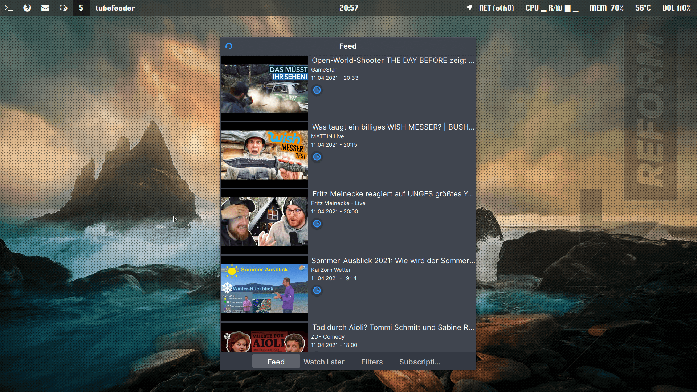

# Tubefeeder for the MNT Reform
[Tubefeeder](https://github.com/Schmiddiii/Tubefeeder) optimized for general desktop usage

# Screenshot

GTK3 Theme: [XFCE Colour](https://www.pling.com/p/1276216)

# Compile
1. Install cargo, rustcc, libhandy-1-dev,... - if something is missing cargo bitches
2. Enter ```cargo build --release```
3. Your build can be found in target/release

# Install
1. Place tubefeeder in ~/.local/bin/ or ~/bin (found in Releases)
2. Place tubefeeder.desktop in ~/.local/share/applications
3. Have fun :)

Please checkout the [original repository](https://github.com/Schmiddiii/Tubefeeder) for more informations.--
